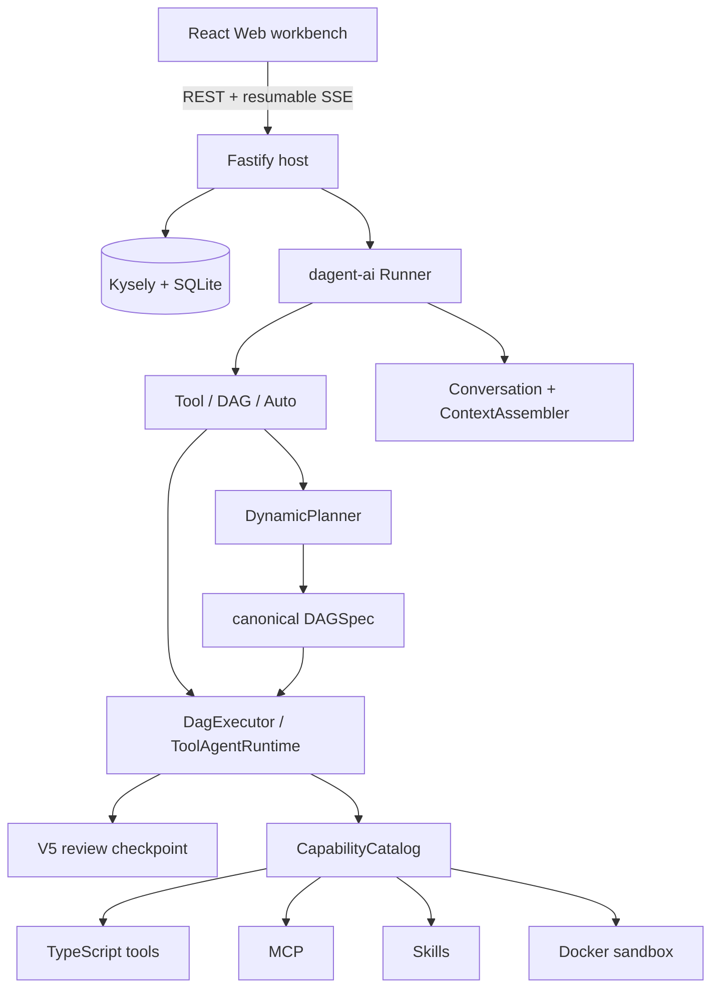

<div align="center">

# Dagent TypeScript

**Plan globally. Re-plan locally.**

A type-safe Agent and DAG runtime for TypeScript.

[Documentation](docs/en/README.md) · [简体中文](README.zh-CN.md) ·
[Quick Start](docs/en/quick-start.md) · [SDK Reference](docs/en/typescript-sdk.md)

</div>

---

Dagent TypeScript is the TypeScript implementation of
[Dagent](https://github.com/RobotSe7en/dagent). It preserves the core semantics of dynamic and
static DAGs, capability catalogs, human review, and resumable execution while redesigning the
public API around TypeScript discriminated unions, generics, Zod schemas, and `AsyncIterable`.

This is not a line-by-line Python port. The SDK, persistent host, and Web workbench live in one
pnpm workspace and share versioned contracts, while application code can still install the
server-independent `dagent-ai` package on its own.

Current version: **0.9.5**. Node.js 24 or newer is required.

## Core Capabilities

1. **Three Agent modes** — ToolAgent uses tools directly, DagAgent plans before execution, and
   AutoAgent chooses the execution mode for each request.
2. **Typed capabilities** — Zod validates inputs and outputs while TypeScript infers execution
   parameters, results, runtime context, risk, and boundary metadata.
3. **Canonical DAGs** — Dynamic planning and `DagBuilder` both produce the same data-only
   `DAGSpec`, validated before execution.
4. **Controlled dataflow** — Capability, agent, first-class condition routing, subgraph, map,
   bounded loop, ordinary edge gates, and artifacts without executing model-generated code.
5. **Resumable review** — Risky calls and DAG reviews create V5 checkpoints with revisions,
   fingerprints, and frozen execution semantics.
6. **Bounded conversation context** — The V3 `ConversationState` is the sole authoritative history,
   with attachments, externalized results, token budgets, compaction, and reasoning isolation.
7. **Unified local application** — Fastify, SQLite, and React provide projects, conversations,
   runs, DAGs, providers, MCP, Skills, capabilities, and artifact management.
8. **Local-first desktop** — DagentWork runs ToolAgent tasks directly through an isolated Electron
   host, with project files, observed diffs, local MCP, Skills, and no enterprise or DAG Studio UI.

## Quick Start

### Use the SDK

```bash
pnpm add dagent-ai zod
```

```ts
import { Runner, defineToolAgent, tool } from 'dagent-ai';
import { OpenAICompatibleProvider } from 'dagent-ai/providers/openai-compatible';
import { z } from 'zod';

const echo = tool({
  id: 'tool.echo',
  description: 'Return the supplied text.',
  input: z.object({ text: z.string() }).strict(),
  output: z.object({ text: z.string() }).strict(),
  execute: ({ text }) => ({ text }),
});

const assistant = defineToolAgent({
  kind: 'tool-agent',
  id: 'assistant',
  name: 'Assistant',
  scope: { capabilities: ['tool.echo'] },
  reviewLevel: 'never',
});

await using runner = new Runner({
  provider: new OpenAICompatibleProvider({
    baseURL: process.env.OPENAI_BASE_URL ?? 'https://api.openai.com/v1',
    model: process.env.OPENAI_MODEL ?? 'gpt-5-mini',
    apiKeyEnv: 'OPENAI_API_KEY',
  }),
  capabilities: [echo],
  workspace: './.dagent-ts',
  runtimeDirectory: '.runtime',
});

for await (const event of runner.stream(assistant, {
  prompt: 'Use echo with “hello TypeScript”, then answer.',
})) {
  if (event.type === 'token' && event.channel === 'content') {
    process.stdout.write(event.content);
  }
}
```

See [examples/basic.ts](examples/basic.ts) for the complete example.

### Start the local application

From this repository:

```bash
corepack enable
pnpm install
pnpm verify

export OPENAI_API_KEY=...
pnpm --filter @dagent/web build
pnpm --filter dagent-ai-app build
node packages/app/dist/cli.js serve --config ./examples/dagent.yaml
```

Open `http://127.0.0.1:8000`. The host binds to the loopback interface by default. See
[Installation](docs/en/installation.md) and
[Runner and Configuration](docs/en/runner-and-configuration.md) for configuration, environment
variables, and data-directory behavior.

### Start DagentWork desktop

```bash
npm install -g dagent-work
dagent-work
```

The launcher installs the native package for the current macOS, Linux, or Windows x64/arm64
platform. Desktop data is isolated from the CLI/Web host. See [DagentWork Desktop](docs/en/desktop.md).

## Typed Static DAG

`DagBuilder<TInput, TOutput>` preserves the relationship between graph input, node output, and final
output in the editor:

```ts
import { DagBuilder, defineStaticDag, tool } from 'dagent-ai';
import { z } from 'zod';

const normalize = tool({
  id: 'tool.normalize',
  input: z.object({ text: z.string() }).strict(),
  output: z.object({ value: z.string() }).strict(),
  execute: ({ text }) => ({ value: text.trim().toLowerCase() }),
});

const graph = new DagBuilder({
  id: 'normalize-text',
  name: 'Normalize text',
  input: z.object({ text: z.string() }),
  output: z.string(),
});

const normalized = graph.capability(normalize, { text: graph.input('text') }, { id: 'normalize' });
graph.setOutput(normalized.output('value'));

const target = defineStaticDag(graph.build());
```

The builder only constructs a safe data graph. `build()` still validates cycles, dependencies,
expressions, execution scopes, and artifacts. See [Static DAGs](docs/en/static-dag.md).

## Architecture



- `dagent-ai` is a standalone SDK with no Fastify, SQLite, or React dependency.
- `dagent-ai-app` is the local host responsible for persistence, concurrency, resources, and static
  Web delivery.
- `@dagent/web` accesses the host only through the versioned HTTP API.
- Boundary values are parsed once; internal flows depend on validated immutable types.

Read the [Architecture Guide](docs/en/architecture.md) for the full design.

## Workspace

```text
dagent-ts/
├── packages/
│   ├── sdk/        # dagent-ai: public SDK, runtime, and contracts
│   ├── app/        # dagent-ai-app: CLI, Fastify, and SQLite
│   └── desktop-*/  # native DagentWork payloads and npm launcher
├── apps/
│   ├── web/        # React workbench
│   └── desktop/    # private Electron build host
├── examples/       # runnable TypeScript and YAML examples
├── docs/
│   ├── en/         # default English documentation
│   └── zh-CN/      # Simplified Chinese documentation
└── reference/      # local upstream reference; not published
```

## Documentation

| Goal                                                 | Documentation                                                                                                                           |
| ---------------------------------------------------- | --------------------------------------------------------------------------------------------------------------------------------------- |
| Install and run a first Agent                        | [Installation](docs/en/installation.md), [Quick Start](docs/en/quick-start.md)                                                          |
| Understand Runner, Agents, DAGs, and capabilities    | [Core Concepts](docs/en/concepts.md)                                                                                                    |
| Find TypeScript public APIs                          | [TypeScript SDK Reference](docs/en/typescript-sdk.md)                                                                                   |
| Configure providers, MCP, profiles, and sandboxing   | [Runner and Configuration](docs/en/runner-and-configuration.md)                                                                         |
| Build capabilities, Agents, static DAGs, and Skills  | [Capabilities](docs/en/capabilities.md), [Agents](docs/en/agents.md), [Static DAGs](docs/en/static-dag.md), [Skills](docs/en/skills.md) |
| Handle conversations, streaming, results, and review | [Conversations, Results, Streaming, and Review](docs/en/results-streaming-review.md)                                                    |
| Integrate or operate the unified host                | [Host Persistence](docs/en/api-backend-persistence.md), [HTTP API](docs/en/http-api.md)                                                 |
| Install and use the local desktop                    | [DagentWork Desktop](docs/en/desktop.md)                                                                                                |
| Design or inspect DAGs without executing them        | [Non-Executing DAG Design](docs/en/dag-design.md)                                                                                       |
| Upgrade from an older host                           | [0.8 Host Migration](docs/en/host-migration-0.8.md), [Migration Notes](docs/en/migration.md)                                            |
| Diagnose common failures                             | [Troubleshooting](docs/en/troubleshooting.md)                                                                                           |

See the [documentation portal](docs/README.md) for language selection.

## Design Boundaries

- Models may propose DAGs but cannot submit JavaScript for the runtime to execute.
- A capability must pass catalog, scope, and schema checks before invocation; review policy still
  governs risky actions.
- Provider reasoning may be retained for internal audit, but it is never replayed into later model
  context or returned by the public API.
- File capabilities enforce lexical and real-path boundaries. The Docker sandbox defaults to no
  network and a read-only root filesystem.
- SSE events are persisted before broadcast and resume from SQLite through `Last-Event-ID`.

## Development

```bash
pnpm typecheck
pnpm lint
pnpm test
pnpm build
pnpm format:check
```

The repository uses a pnpm workspace and TypeScript project references. Published packages are ESM,
and runtime values and public types are exposed through the same exports map.

## Version Alignment

This implementation currently tracks the public runtime semantics of Dagent **0.9.5**. Python and
TypeScript do not promise symbol-for-symbol API compatibility. Migrations should follow behavioral
contracts and the TypeScript examples in this repository.

## License

[Apache License 2.0](LICENSE)
