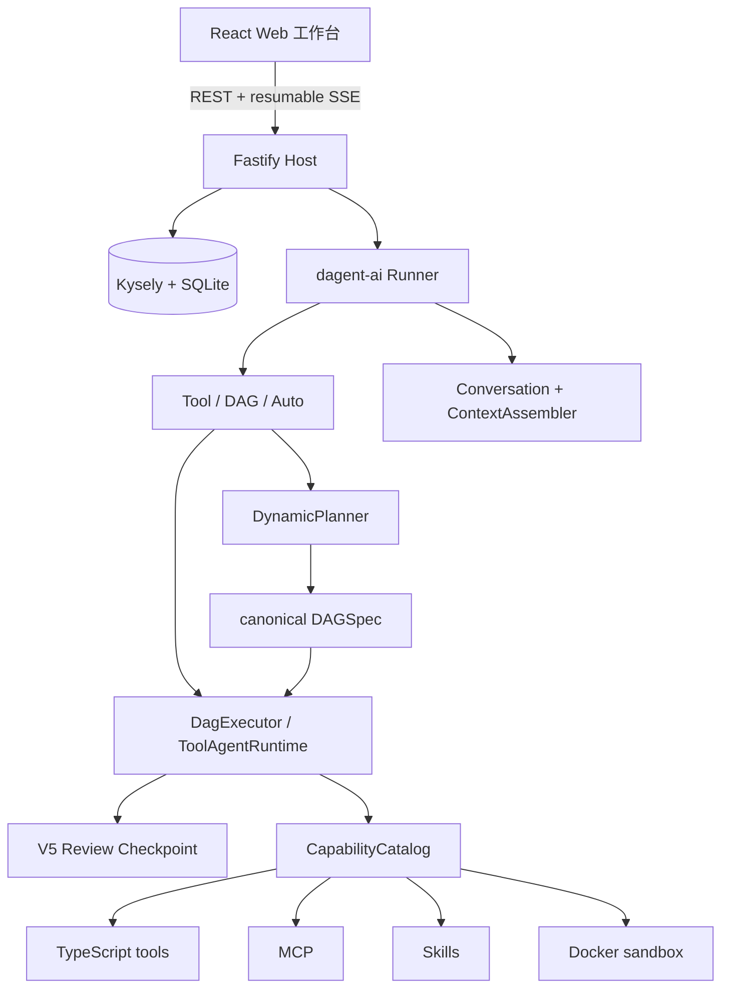

<div align="center">

# Dagent TypeScript

**Plan globally. Re-plan locally.**

面向 TypeScript 的类型安全 Agent 与 DAG 运行时。

[English](README.md) · [文档](docs/zh-CN/README.md) ·
[快速开始](docs/zh-CN/quick-start.md) · [SDK 参考](docs/zh-CN/typescript-sdk.md)

</div>

---

Dagent TypeScript 是 [Dagent](https://github.com/RobotSe7en/dagent) 的 TypeScript
实现。它保留动态 DAG、静态 DAG、能力目录、人工审核和可恢复执行等核心语义，同时利用
TypeScript 的判别联合、泛型、Zod schema 与 `AsyncIterable` 重新设计公开 API。

这不是 Python 代码的逐行翻译。SDK、持久化 Host 和 Web 工作台位于同一 pnpm
workspace，共享一套版本化契约；业务代码仍可以只安装无服务端依赖的 `dagent-ai`。

当前版本：**0.9.5**。要求 Node.js 24 或更高版本。

## 核心能力

1. **三种 Agent 模式** — ToolAgent 直接使用工具；DagAgent 先规划再执行；
   AutoAgent 根据任务选择执行方式。
2. **类型化能力** — 输入和输出由 Zod 校验，执行函数获得类型推导、运行上下文、风险与
   边界元数据。
3. **Canonical DAG** — 动态规划和 `DagBuilder` 最终都产生同一份纯数据 `DAGSpec`，
   运行前统一校验。
4. **受控 Dataflow** — 支持 capability、agent、一等 condition 路由、subgraph、map、
   bounded loop、普通 edge gate 与 artifact，不执行模型生成的任意代码。
5. **可恢复审核** — 高风险调用和 DAG 审核生成带 revision、fingerprint 与冻结执行计划的
   V5 checkpoint。
6. **有界会话上下文** — V3 `ConversationState` 是唯一权威历史，支持附件、外置结果、
   token 预算、摘要压缩和推理隔离。
7. **统一本地应用** — Fastify、SQLite 和 React 工作台提供项目、会话、运行、DAG、
   Provider、MCP、Skills、能力和产物管理。
8. **本地优先桌面端** — DagentWork 通过隔离的 Electron Host 直接运行 ToolAgent 任务，
   提供项目文件、实际变化、MCP 与 Skills，不包含企业版或 DAG Studio 界面。

## 快速开始

### 使用 SDK

```bash
pnpm add dagent-ai zod
```

```ts
import { Runner, defineToolAgent, tool } from 'dagent-ai';
import { OpenAICompatibleProvider } from 'dagent-ai/providers/openai-compatible';
import { z } from 'zod';

const echo = tool({
  id: 'tool.echo',
  description: 'Return the supplied text.',
  input: z.object({ text: z.string() }).strict(),
  output: z.object({ text: z.string() }).strict(),
  execute: ({ text }) => ({ text }),
});

const assistant = defineToolAgent({
  kind: 'tool-agent',
  id: 'assistant',
  name: 'Assistant',
  scope: { capabilities: ['tool.echo'] },
  reviewLevel: 'never',
});

await using runner = new Runner({
  provider: new OpenAICompatibleProvider({
    baseURL: process.env.OPENAI_BASE_URL ?? 'https://api.openai.com/v1',
    model: process.env.OPENAI_MODEL ?? 'gpt-5-mini',
    apiKeyEnv: 'OPENAI_API_KEY',
  }),
  capabilities: [echo],
  workspace: './.dagent-ts',
  runtimeDirectory: '.runtime',
});

for await (const event of runner.stream(assistant, {
  prompt: 'Use echo with “hello TypeScript”, then answer.',
})) {
  if (event.type === 'token' && event.channel === 'content') {
    process.stdout.write(event.content);
  }
}
```

完整示例见 [examples/basic.ts](examples/basic.ts)。

### 启动本地应用

在本仓库开发：

```bash
corepack enable
pnpm install
pnpm verify

export OPENAI_API_KEY=...
pnpm --filter @dagent/web build
pnpm --filter dagent-ai-app build
node packages/app/dist/cli.js serve --config ./examples/dagent.yaml
```

打开 `http://127.0.0.1:8000`。Host 默认只监听本机地址；配置、环境变量和数据目录说明见
[安装](docs/zh-CN/installation.md) 与
[Runner 和配置](docs/zh-CN/runner-and-configuration.md)。

### 启动 DagentWork 桌面端

```bash
npm install -g dagent-work
dagent-work
```

Launcher 会安装当前 macOS、Linux 或 Windows x64/arm64 平台对应的原生包。桌面数据与
CLI/Web Host 隔离。详见 [DagentWork 桌面端](docs/zh-CN/desktop.md)。

## 类型化静态 DAG

`DagBuilder<TInput, TOutput>` 让输入、节点输出和最终输出在编辑器中保持类型关系：

```ts
import { DagBuilder, defineStaticDag, tool } from 'dagent-ai';
import { z } from 'zod';

const normalize = tool({
  id: 'tool.normalize',
  input: z.object({ text: z.string() }).strict(),
  output: z.object({ value: z.string() }).strict(),
  execute: ({ text }) => ({ value: text.trim().toLowerCase() }),
});

const graph = new DagBuilder({
  id: 'normalize-text',
  name: 'Normalize text',
  input: z.object({ text: z.string() }),
  output: z.string(),
});

const normalized = graph.capability(normalize, { text: graph.input('text') }, { id: 'normalize' });
graph.setOutput(normalized.output('value'));

const target = defineStaticDag(graph.build());
```

Builder 只负责安全地构造数据图；`build()` 仍会进行环、依赖、表达式、作用域和 artifact
校验。详见 [静态 DAG](docs/zh-CN/static-dag.md)。

## 架构



- `dagent-ai` 是独立 SDK，不依赖 Fastify、SQLite 或 React。
- `dagent-ai-app` 是本地 Host，负责持久化、并发控制、资源管理和静态 Web。
- `@dagent/web` 只通过版本化 HTTP API 访问 Host，不导入运行时内部对象。
- 跨边界对象进入领域层时只解析一次，内部流程依赖已验证的不可变类型。

进一步阅读：[架构说明](docs/zh-CN/architecture.md)。

## 工作区

```text
dagent-ts/
├── packages/
│   ├── sdk/        # dagent-ai：公开 SDK、运行时和契约
│   ├── app/        # dagent-ai-app：CLI、Fastify、SQLite
│   └── desktop-*/  # 原生 DagentWork 载荷与 npm launcher
├── apps/
│   ├── web/        # React 工作台
│   └── desktop/    # 私有 Electron 构建 Host
├── examples/       # 可运行的 TypeScript 与 YAML 示例
├── docs/
│   ├── en/         # 默认英文文档
│   └── zh-CN/      # 简体中文文档
└── reference/      # 本地上游参考副本，不参与发布
```

## 文档

| 目标                                    | 文档                                                                                                                                             |
| --------------------------------------- | ------------------------------------------------------------------------------------------------------------------------------------------------ |
| 安装并跑通第一个 Agent                  | [安装](docs/zh-CN/installation.md)、[快速开始](docs/zh-CN/quick-start.md)                                                                        |
| 理解 Runner、Agent、DAG 和能力          | [核心概念](docs/zh-CN/concepts.md)                                                                                                               |
| 查询 TypeScript 公开入口                | [TypeScript SDK 参考](docs/zh-CN/typescript-sdk.md)                                                                                              |
| 配置 Provider、MCP、Profiles 和 Sandbox | [Runner 和配置](docs/zh-CN/runner-and-configuration.md)                                                                                          |
| 编写能力、Agent、静态 DAG 与 Skills     | [Capabilities](docs/zh-CN/capabilities.md)、[Agents](docs/zh-CN/agents.md)、[静态 DAG](docs/zh-CN/static-dag.md)、[Skills](docs/zh-CN/skills.md) |
| 处理会话、流式事件、结果和审核          | [会话、结果、流式与审核](docs/zh-CN/results-streaming-review.md)                                                                                 |
| 部署或集成统一 Host                     | [Host 持久化](docs/zh-CN/api-backend-persistence.md)、[HTTP API](docs/zh-CN/http-api.md)                                                         |
| 安装和使用本地桌面端                    | [DagentWork 桌面端](docs/zh-CN/desktop.md)                                                                                                       |
| 在不执行的前提下设计或检查 DAG          | [非执行 DAG 设计](docs/zh-CN/dag-design.md)                                                                                                      |
| 从旧版升级                              | [0.8 Host 迁移](docs/zh-CN/host-migration-0.8.md)、[迁移说明](docs/zh-CN/migration.md)                                                           |
| 定位常见错误                            | [故障排查](docs/zh-CN/troubleshooting.md)                                                                                                        |

完整入口见 [中文文档](docs/zh-CN/README.md)。

## 设计边界

- 模型可以提出 DAG，但不能提交 JavaScript 代码供运行时执行。
- Capability 必须通过目录、作用域和 schema 后才能调用；高风险动作仍受审核策略约束。
- Provider reasoning 可用于内部审计，但不会回放到下一轮上下文，也不会经公共 API 暴露。
- 文件能力使用词法路径与真实路径双重边界校验；Docker 沙箱默认无网络、只读根文件系统。
- SSE 事件先持久化后广播，可用 `Last-Event-ID` 从 SQLite 恢复。

## 开发

```bash
pnpm typecheck
pnpm lint
pnpm test
pnpm build
pnpm format:check
```

仓库采用 pnpm workspace 与 TypeScript project references。发布包使用 ESM；公开类型和实现
从相同的 `exports` map 输出。

## 版本关系

本实现当前与 Dagent **0.9.5** 的公开运行语义对齐。Python 与 TypeScript 版本不承诺
逐符号 API 相同：迁移时应对照行为契约，并使用本仓库文档中的 TypeScript 示例。

## License

[Apache License 2.0](LICENSE)
