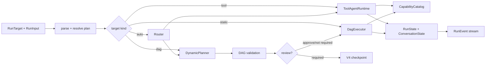

# 架构

Dagent TypeScript 在一个仓库中统一 SDK、Host 和 Web，但保持清晰的依赖方向：

```text
apps/web ────────HTTP────────> packages/app ────────> packages/sdk

业务应用 ──────────────────────────────────────────> packages/sdk
```

`packages/sdk` 不反向依赖 App；Web 不直接导入 Runner。所谓“统一”是共同维护一套
TypeScript 契约和发布节奏，不是把浏览器、数据库和模型运行时混成一个模块。

## 分层

```text
React Web UI
    │ REST + resumable SSE
Fastify application
    │ services / repositories
Kysely + SQLite
    │
dagent-ai Runner
    ├─ ToolAgentRuntime
    ├─ DynamicPlanner → canonical DAGSpec
    ├─ DagExecutor
    ├─ review checkpoints
    └─ context assembler / result storage
         │
CapabilityCatalog
    ├─ TypeScript capabilities
    ├─ MCP stdio / streamable HTTP
    ├─ Skills accessors
    └─ optional Docker command executor
```

`dagent-ai` 不依赖服务端或浏览器。`dagent-ai-app` 负责本地单用户进程、数据库、HTTP
生命周期和静态 UI。Web 端只消费版本化 API，不接触运行时内部对象。

## SDK 内部边界



- `contracts/`：Zod schema、判别联合和版本化序列化格式。
- `domain/`：不依赖 I/O 的 DAG 结构与 scope 校验。
- `runtime/`：Agent loop、planner、executor、上下文、artifact、事件和预算。
- `capabilities/`：绑定、目录、workspace 与内置工具。
- `providers/`：模型协议适配。
- `mcp/`、`skills/`、`profiles/`、`sandbox/`：可选集成边界。

模块通过公开接口协作，不共享可变“全局上下文”对象。

## 核心契约

- `CapabilityBinding<TInput, TOutput>` 将 Zod schema、执行函数和边界元数据绑定。
- `DAGSpec` 是唯一执行图格式。节点支持 capability、agent、subgraph、map 和 bounded
  loop。
- `RunState` 是 V3 当前状态；V4 `RunCheckpoint` 冻结目标、能力作用域、限制、
  `runtimeDirectory`、初始 `extraSystemPrompt` 和状态。
- `RunEvent` 是带运行 ID、序号和时间戳的判别联合。
- `ConversationState` 是 Provider-neutral 的历史记录。

所有跨边界数据在进入领域层时解析一次。内部逻辑依赖已解析类型，不在各层重复猜测结构。

版本关系：

- canonical DAG：schema version 1
- `ConversationState` / `RunState`：V3
- `ResolvedRunPlan` / `RunCheckpoint`：V4

版本号不同是因为这些契约独立演进。Host 不应把它们合并成一个数据库 schema version。

## 执行与恢复

静态 DAG 先进行完整结构校验：重复 ID、环、边、表达式依赖和 artifact 引用都会在执行前
失败。动态 DAG 使用结构化输出，同样经过校验和能力白名单检查。

节点失败时，动态 Agent 可在 `maxReplans` 限制内重新规划。只有已完成节点会被保护并
复用；失败节点允许替换或重跑。审核使用 checkpoint fingerprint，过期 revision 会被
拒绝。审核后的执行若失败并重新规划到下一个审核边界，权威会话 revision 会严格推进。

SDK 要求 Host 显式传入 `workspace` 和安全相对的 `runtimeDirectory`。会话资源位于
`<workspace>/<runtimeDirectory>/conversations`；外置结果和恢复历史分别位于每次运行
工作区的 `<runtimeDirectory>/results` 与 `<runtimeDirectory>/history`，且按需创建。

## 安全边界

- Workspace 同时进行路径规范化和 `realpath` 检查；写入拒绝最终符号链接。
- Shell 能力默认是高风险能力，并拦截明确的系统级破坏命令。
- Docker 后端使用只读根文件系统、无网络默认值、能力全丢弃、进程/CPU/内存限制。
- MCP 工具在接入时转成普通能力，仍然经过作用域和审核策略。
- TS 工具模块要求显式路径和导出名，并可限制在配置目录内。

## 持久化

SQLite 使用 WAL、外键和 busy timeout。服务启动时获取带心跳的单写者租约。
`run_events` 对 `(run_id, sequence)` 建立唯一约束。会话表只保存 identity 匹配的完整 V3
`ConversationState`；checkpoint 独立保存在 run 表。会话整体替换使用 revision CAS，
review 恢复先对 checkpoint 做原子 claim。公共消息、trace 和 context usage 都是权威
文档或 run 事件的投影，不是第二份状态。

## Host 请求流程

启动运行时：

1. HTTP 层用 Zod 解析 target 与 input，并将 base64 upload 解码为 `Uint8Array`。
2. RunService 为 conversation 建立进程内独占声明，读取 V3 权威历史。
3. Runner 发出第一个事件后，Host 创建 run 记录。
4. 每个事件先插入 `run_events`，checkpoint 与 conversation 在事务中按 revision 更新。
5. 持久化成功后再向 SSE 订阅者广播。
6. 完成、失败或取消后释放 conversation；等待审核时保持其独占状态。

恢复审核时先在数据库中原子 claim checkpoint，再调用 `resumeStream()`。Runner 产生的局部
sequence 被 Host 映射到该 run 已有事件之后，外部客户端始终看到单调序列。

## Web 模块

React 工作台按用户能力划分：

- projects：项目与会话导航
- chat：消息、运行和审核交互
- dag：静态 DAG 编辑与校验
- inspector：事件、trace、usage 和 checkpoint 查看
- settings：Provider、Agent、MCP、能力、Validation、Skills 与 Sandbox
- workbench：项目文件、运行产物和可选 OnlyOffice 集成

客户端状态保存资源 id 和公共投影，不持有 SDK 内部 Runner、完整 conversation 或密钥。

## 继续阅读

- [核心概念](concepts.md)
- [会话历史与上下文](conversation-history.md)
- [Host 持久化](api-backend-persistence.md)
- [HTTP API](http-api.md)
