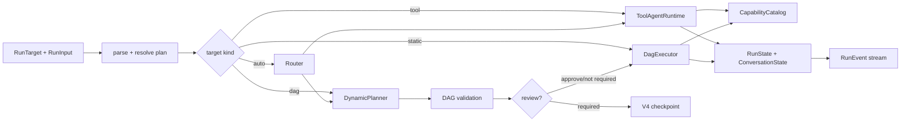

# Architecture

Dagent TypeScript unifies SDK, host, and Web in one repository while preserving a clear dependency
direction:

```text
apps/web ────────HTTP────────> packages/app ────────> packages/sdk

business applications ─────────────────────────────> packages/sdk
```

`packages/sdk` never depends back on App, and Web does not import Runner. “Unified” means one set of
TypeScript contracts and one release cadence, not mixing browser, database, and model runtime into
one module.

## Layers

```text
React Web UI
    │ REST + resumable SSE
Fastify application
    │ services / repositories
Kysely + SQLite
    │
dagent-ai Runner
    ├─ ToolAgentRuntime
    ├─ DynamicPlanner → canonical DAGSpec
    ├─ DagExecutor
    ├─ review checkpoints
    └─ context assembler / result storage
         │
CapabilityCatalog
    ├─ TypeScript capabilities
    ├─ MCP stdio / streamable HTTP
    ├─ Skills accessors
    └─ optional Docker command executor
```

`dagent-ai` has no server or browser dependency. `dagent-ai-app` owns the local single-user process,
database, HTTP lifecycle, and static UI. Web consumes only the versioned API and never touches
runtime internals.

## SDK Boundaries



- `contracts/`: Zod schemas, discriminated unions, and versioned serialization formats
- `domain/`: I/O-independent DAG structure and scope validation
- `runtime/`: Agent loops, planner, executor, context, artifacts, events, and budgets
- `capabilities/`: bindings, catalog, workspace, and built-in tools
- `providers/`: model protocol adapters
- `mcp/`, `skills/`, `profiles/`, `sandbox/`: optional integration boundaries

Modules collaborate through public interfaces rather than a shared mutable “global context.”

## Core Contracts

- `CapabilityBinding<TInput, TOutput>` joins Zod schemas, execution, and boundary metadata.
- `DAGSpec` is the sole execution graph format, supporting capability, agent, subgraph, map, and
  bounded-loop nodes.
- `RunState` is V3 current state. V4 `RunCheckpoint` freezes target, capability scope, limits,
  `runtimeDirectory`, initial `extraSystemPrompt`, and state.
- `RunEvent` is a discriminated union with run id, sequence, and timestamp.
- `ConversationState` is provider-neutral history.

Boundary data is parsed once on entry to the domain. Internal code depends on parsed types rather
than repeatedly guessing structure.

Contract versions:

- canonical DAG: schema version 1
- `ConversationState` / `RunState`: V3
- `ResolvedRunPlan` / `RunCheckpoint`: V4

These versions differ because contracts evolve independently. A host must not collapse them into
one database schema version.

## Execution and Resumption

A static DAG receives full structural validation before execution: duplicate ids, cycles, edges,
expression dependencies, and artifact references all fail early. Dynamic DAG structured output
passes the same graph and capability-allowlist checks.

After node failure, a dynamic Agent can re-plan within `maxReplans`. Completed nodes are protected
and reused; failed nodes may be replaced or rerun. Review uses checkpoint fingerprints, and stale
revisions are rejected. If reviewed execution fails and re-plans to another review boundary, the
authoritative conversation revision advances.

The SDK defaults `workspace` to `~/.dagent` and `runtimeDirectory` to the safe relative `.runtime`;
storage-owning hosts provide both explicitly.
Conversation resources live under `<workspace>/<runtimeDirectory>/conversations`; externalized
results and restored history live under each run workspace's `<runtimeDirectory>/results` and
`<runtimeDirectory>/history`, created lazily.

## Safety Boundaries

- Workspace checks normalized and real paths; writes reject a final symlink.
- Shell is high risk by default and blocks explicit system-level destructive commands.
- Docker uses a read-only root filesystem, no network by default, dropped capabilities, and
  process/CPU/memory limits.
- MCP tools become ordinary capabilities and still pass scope and review policy.
- TypeScript tool modules require explicit paths and export names and can be constrained to a
  configuration directory.

## Persistence

SQLite enables WAL, foreign keys, and a busy timeout. The service acquires a heartbeat-backed
single-writer lease at startup. `run_events` has a unique `(run_id, sequence)` constraint. The
conversation table stores only complete identity-matched V3 `ConversationState`; checkpoints live
separately on runs. Whole-conversation updates use revision CAS, and review resumption atomically
claims a checkpoint. Public messages, traces, and context usage are projections of authoritative
documents or events, not second writable states.

## Host Request Flow

When starting a run:

1. HTTP parses target and input with Zod and decodes base64 uploads to `Uint8Array`.
2. RunService claims the conversation in-process and reads authoritative V3 history.
3. After Runner emits the first event, the host creates the run record.
4. Every event is inserted into `run_events`; checkpoint and conversation updates use revision
   transactions.
5. SSE subscribers receive an event only after successful persistence.
6. Completion, failure, or cancellation releases the conversation; review waiting retains the
   claim.

Review resumption atomically claims the checkpoint in the database before calling `resumeStream()`.
The host maps Runner's local resumed sequence after the run's existing events, so external clients
always observe a monotonic sequence.

## Web Modules

The React workbench is divided by user capability:

- projects: project and conversation navigation
- chat: messages, runs, and review interaction
- dag: static DAG editing and validation
- inspector: events, trace, usage, and checkpoint views
- settings: provider, Agent, MCP, capability, validation, Skills, and sandbox
- workbench: project files, run artifacts, and optional OnlyOffice integration

Client state retains resource ids and public projections, not Runner internals, complete
conversations, or credentials.

## Read Next

- [Core Concepts](concepts.md)
- [Conversation History and Context](conversation-history.md)
- [Host Persistence](api-backend-persistence.md)
- [HTTP API](http-api.md)
